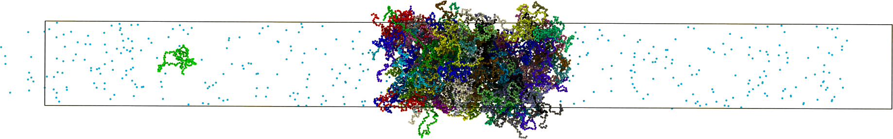

# Simulation of small molecules on IDP systems



## Table of Contents

- [About](#about)
- [Getting Started](#getting_started)
- [Usage](#usage)
- [Results](#results)
- [Contributing](../CONTRIBUTING.md)

## About <a name = "about"></a>

[OpenMM](https://openmm.org/)-based simulation toolkit aimed at the simulation of intrinsically disordered proteins with the capability of introducing coarse-grained small molecules into the system to study their effects on biological liquid-liquid phase separation.

## Getting Started <a name = "getting_started"></a>

These instructions will get you a copy of the project up and running on your local machine for development and performing simulations. 

### Prerequisites

All of the modules from this simulation toolkit employ Python and use the OpenMM Molecular Dynamics python API, therefore `python>=3.8.10` is required.

The OpenMM MD library is also needed. There is a straightforward way of installing OpenMM with the [conda package manager](https://docs.conda.io/). This repository includes a conda-compatible [environment.yaml](./modules/environment.yaml) file which already contains the correct OpenMM version for easy installation (more information in the [corresponding section](#cond_inst))

Additionally, please see [the official OpenMM instructions](http://docs.openmm.org/latest/userguide/application/01_getting_started.html#installing-openmm) in order to get up-to-date information on how to compile from source.

In order to be able to run the calculations on the GPU (strongly recommended), either CUDA or OpenCL can be employed. The conda environment dependency file includes the cudatoolkit package required to make use of CUDA on Nvidia GPUs. If OpenMM is compiled from source, CUDA will have to be installed manually.

The rest of dependencies are included in both [environment.yaml](./modules/environment.yaml) and [requirements.txt](./modules/requirements.txt) files.

### Installing - Conda <a name = "cond_inst"></a>

This section includes a brief walkthrough on how to install this toolkit using the conda package manager in a GNU/Linux system. As all of the required dependencies are included on the [environment.yaml](./modules/environment.yaml) file, the procedure is straightforward.

1. First, open a terminal and create a directory where the script will be installed, then clone this repository:

```bash
cd $IDPWORKDIR
git clone <this-repo-url>
```

2. Once the repository is cloned, go into the [modules](./modules/) folder and run the following command in order to install all the required packages using the conda distribution:

```bash
conda env create -f environment.yaml
```

This will create a conda environment named `idp-simul-smallmolec`. This name can be changed by editing the `name:` line in the [environment.yaml](./modules/environment.yaml) file.

3. Activate this environment with:

```
conda activate idp-simul-smallmolec
```

### Installing - Python Environment <a name = "cond_inst"></a>

This section includes a brief walkthrough on how to install this toolkit into the main python distribution or into a given python environment (recommended) in a GNU/Linux system. This method requires compiling OpenMM from source and installing CUDA by hand. Additional python required dependencies are listed on the [requirements.txt](./modules/requirements.txt) file.

1. First, create a python environment in which to install OpenMM and activate it. Leave this environment active for the remainder of this guide. Alternatively, everything could be installed in the main python distribution, but this is not recommended.

2. Next, follow [the official OpenMM instructions](http://docs.openmm.org/latest/userguide/application/01_getting_started.html#installing-openmm) to compile and install OpenMM into the created python environment.

3. Install a version of CUDA compatible with your GPU using your package manager of choice or with the official nvidia installer / compiling from source.

4. Create an installation directory and clone this repository by running:

```bash
cd $IDPWORKDIR
git clone <this-repo-url>
```

5. Change to the [modules](./modules/) folder and use the requirements.txt with pip to install the remaining dependencies:

```bash
python3 -m pip install -r requirements.txt
```

After this, the toolkit should be ready to be used in the 


### Checking the installation <a name = "check_inst"></a>
If installed correctly, the following command can be used in order to test OpenMM's correct installation and available [platforms](http://docs.openmm.org/latest/userguide/library/01_introduction.html#platforms):

```bash
python -m openmm.testInstallation
```

which should result in an output similar to:

```
OpenMM Version: 7.7
Git Revision: ad113a0cb37991a2de67a08026cf3b91616bafbe

There are 4 Platforms available:

1 Reference - Successfully computed forces
2 CPU - Successfully computed forces
3 CUDA - Successfully computed forces
4 OpenCL - Successfully computed forces

Median difference in forces between platforms:

Reference vs. CPU: 6.28782e-06
Reference vs. CUDA: 6.72858e-06
CPU vs. CUDA: 7.36916e-07
Reference vs. OpenCL: 6.76294e-06
CPU vs. OpenCL: 7.99247e-07
CUDA vs. OpenCL: 2.66273e-07

All differences are within tolerance.
```
The exact output from this command may vary depending on your configuration. 

If the command is being run on a compute cluster, please make sure that it is launched from a script commited into the the clusters queue manager in order to be executed in an actual node and not directly from the login node, as CUDA, OpenCL and even the CPU platforms may not be available on these nodes.

## Usage <a name = "usage"></a>

To run simulations, execute the `simulate.py` script with your python environment. An alias can be created in order to facilitate running the script from different directories:

```
alias idp_simul="/<env-path>/bin/python3 /path/to/the/executable/simulate.py"
```
Substitute `<env-path>` with your desired python environment path or `/<env-path>/bin/python3` with `python3` in order to use the main python distribution if OpenMM is installed there.

Using this alias, here's an example of a command to run a simulation of 100 IDP chains at 310K adding 20mM coarse-grained GLY as the small molecule for 42000s using the GPUs 0 and 1:

```bash
idp_simul --name Q5-8_20 --temp 310 --small-molec GLY 20 0 --time 43200 --gpu 0 1
```

Another  example command to run a Q5-8_20 simulation at 315K using a small molecule chain with 5 residues, while defining the interaction strength of each residue. The simulation will run for 43200 seconds and using the cpu:

```bash
idp_simul --name Q5-8_20 --temp 315 --small_molec GLY-GLY-GLY-ARG-GLY 1 0.5 --lmb 0.350 0.900 0.1 0.1 0.1 --time 43200 --cc 10 --cpu
```


As shown above, the script includes an argument parser which requires several arguments. This is the intended way to use this toolkit.

The available arguments are:
- Main simulation parameters:
    - `name NAME` or `-N NAME`:  Name of the protein sequence to be simulated.
    - `temp TEMP` or `-T TEMP`:  Temperature (in K) of the system.

- Small molecule parameters:

    - `--small_molec RES CONC DISTANCE` or `-s RES CONC DISTANCE`: Residue Names (3 letter name, if using more than one residue, join them with a hyphen), concentration (in mM) and distance between particles (in A) of the small molecules to be added. For example: `--small_molec ARG-LYS-GLY-GLY-GLY 20 0.5`

    - `--lambd LAMBD [LAMBD ...]` or `--lam LAMBD [LAMBD ...]` or `--lmb LAMBD [LAMBD ...]`: List of float lambda values to use for the small molecules, given in the same order as the small molecules. For example: `--lmbd 0.350 0.900 0.1 0.6 0.1`

    - `--sigma SIGMA [SIGMA ...]` or `--sig SIGMA [SIGMA ...]`: List of float sigma values to use for the small molecules, given in the same order as the small molecules.

    - `--mass MASS [MASS ...]` or `-m MASS [MASS ...]`: List of float molar mass values to use for the small molecules, given in the same order as the small molecules.

    - `--check_collision DISTANCE` or `--cc DISTANCE`
                        If present, enables collision check after adding the small molecules into the system. Omit this option to disable the check.Takes a distance
                        value (in A) between the small molecules and the protein to check for collision.

- Output options:
  - `-v` or `--verbose`: Increase output verbosity
  - `-q` or `--quiet`: Decrease output verbosity

- Simulation time selection:
  - `--nsteps [NSTEPS]` or `--steps [NSTEPS]` or `-n [NSTEPS]`: Number of timesteps to run the simulation.
  - `--time [NSECONDS]` or `--tsec [NSECONDS]` or `-t [NSECONDS]`: Number of seconds to run the simulation.

- Simulation configuration:
  - `--cpu`: Use the CPU as platform for the openmm.simulation.
  - `--gpu GPUID [GPUID ...]`: Use the GPU as platform for the openmm.simulation. More than one GPU can be passed to this argument in order to use several GPUs.

- Simulation post-treatment:
  - `--extend_thermostat TEMP NSTEPS` or `--ethermo TEMP NSTEPS` or `--et TEMP NSTEPS`: If present, after finishing the main dynamics, modify the thermostat temperature and run the simulation for a given number of steps.
  `extend_thermostat` takes two arguments: the first is the new temperature and the second is the number of steps to run the simulation.


## Results <a name = "results"></a>

The script produces several output files after a simulation. Using as an example `XXXX` for the protein name, `YYY` for the temperature and `ZZZ` for the small-molecule name:

- `parameters.dat`: Includes information about the user defined parameters used in the simulation

- `XXXX_YYY_ZZZ_report.dcd`: Trajectory file containing the particle positions at every timestep of the simulation.

- `sm_drg_traj.pdb`: PDB file containing the description and positions of the initial system configuration.

- `XXXX_YYY.log`: Log file containing information about the system's energies, performance and simulation times.

A dataframe containing of some of the most important results obtained from the simulations can be found in the [results](./results/) folder. The dataframe can be accessed using [pandas](https://pandas.pydata.org/). Some sample visualizations and usage examples are included in a python notebook on the same directory.
